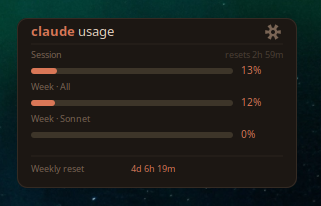

# Claude Usage Desktop Widget

A lightweight Linux desktop widget that displays your Claude subscription usage in real-time — session limits, weekly caps, and reset timers.



## Features

- **Real-time usage bars** — Session (5h), Weekly (all models), Sonnet, and Opus
- **Color-coded thresholds** — Green (<50%), Amber (50-85%), Red (>85%)
- **Draggable** — Click and drag the title bar to reposition
- **Adjustable transparency** — Opacity slider in settings
- **Auto-detects Claude Code** — If you have Claude Code installed, it finds your credentials automatically
- **Manual token support** — Paste your OAuth token if you don't use Claude Code
- **Persists settings** — Position, opacity, and credentials survive restarts

## Requirements

- Linux with a compositing window manager (GNOME, KDE, etc.)
- Python 3.8+
- GTK3 Python bindings

```bash
sudo apt install python3-gi python3-gi-cairo
```

## Install

```bash
# Clone or download
git clone https://github.com/boutabyte/claude-usage-widget.git
cd claude-usage-widget

# Make executable
chmod +x claude-usage-widget.py

# Run
./claude-usage-widget.py
```

## Connecting Your Account

### Option 1: Claude Code (automatic)
If you have [Claude Code](https://docs.anthropic.com/en/docs/claude-code) installed and authenticated, the widget detects your credentials automatically. Just launch it.

### Option 2: OAuth Token (manual)
1. Click the gear icon on the widget
2. Paste your Anthropic OAuth access token (`sk-ant-oat01-...`)
3. Click "Connect Account"

To get your token, check `~/.claude/.credentials.json` after authenticating with Claude Code, or use the Anthropic OAuth flow.

## Autostart

To launch the widget on login:

```bash
# Create autostart entry
mkdir -p ~/.config/autostart
cat > ~/.config/autostart/claude-usage-widget.desktop << 'EOF'
[Desktop Entry]
Type=Application
Name=Claude Usage Widget
Exec=/path/to/claude-usage-widget.py
Hidden=false
NoDisplay=false
X-GNOME-Autostart-enabled=true
EOF
```

## Configuration

Settings are stored in `~/.config/claude-usage-widget/settings.json`:

```json
{
  "opacity": 0.90,
  "x": 1620,
  "y": 60
}
```

Credentials (if manually provided) are stored in `~/.config/claude-usage-widget/credentials.json`.

## How It Works

The widget polls the Anthropic OAuth usage API (`/api/oauth/usage`) every 30 seconds using your OAuth access token. It displays:

| Meter | Description |
|-------|-------------|
| Session | 5-hour rolling usage window |
| Week - All | 7-day usage across all models |
| Week - Sonnet | 7-day Sonnet-specific usage |
| Week - Opus | 7-day Opus-specific usage |

## Built by [Boutabyte](https://boutabyte.com)

## License

MIT
